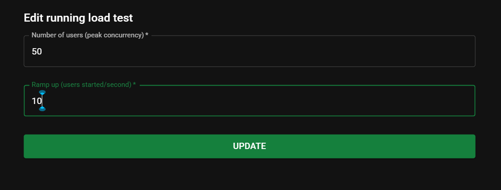
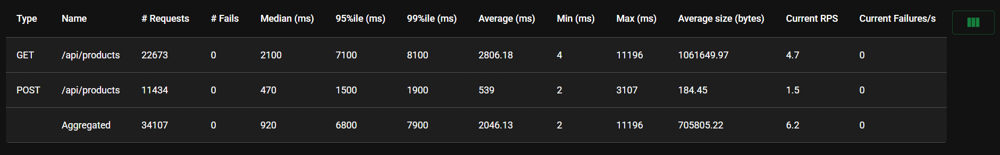

# Backend CRUD con Pruebas y CI/CD

Este proyecto implementa un sistema de gestión de productos y categorías con validaciones, pruebas automatizadas y pipeline CI/CD.


Pruebas automatizadas

Se implementan:

- Pruebas unitarias
- Pruebas de integración con base de datos
- Prueba end-to-end de actualización de stock

Para ejecutar las pruebas:

```
npm test
```

Análisis de seguridad

- Análisis estático de código con ESLint y eslint-plugin-security
- Validaciones en modelos Mongoose
- Auditoría de dependencias:

```
npm audit
npm audit fix
```

Pipeline CI/CD

El pipeline se ejecuta automáticamente en cada push a `main`, `master` o `develop`. Fases incluidas:

1. Instalación de dependencias
2. Análisis estático de código
3. Pruebas unitarias e integración
4. Simulación de prueba de performance
5. Mensaje final si todo es exitoso

Archivo: `.github/workflows/ci.yml`

Pruebas de carga (Locust)

Simulación de carga con 50 usuarios concurrentes:

- Endpoint GET /api/products
- Endpoint POST /api/products

Archivo: `locustfile.py`

Para ejecutar:

```
python -m locust
```



Luego acceder a http://localhost:8089



Requisitos

- Node.js 20 o superior
- MongoDB ejecutándose en localhost:27017
